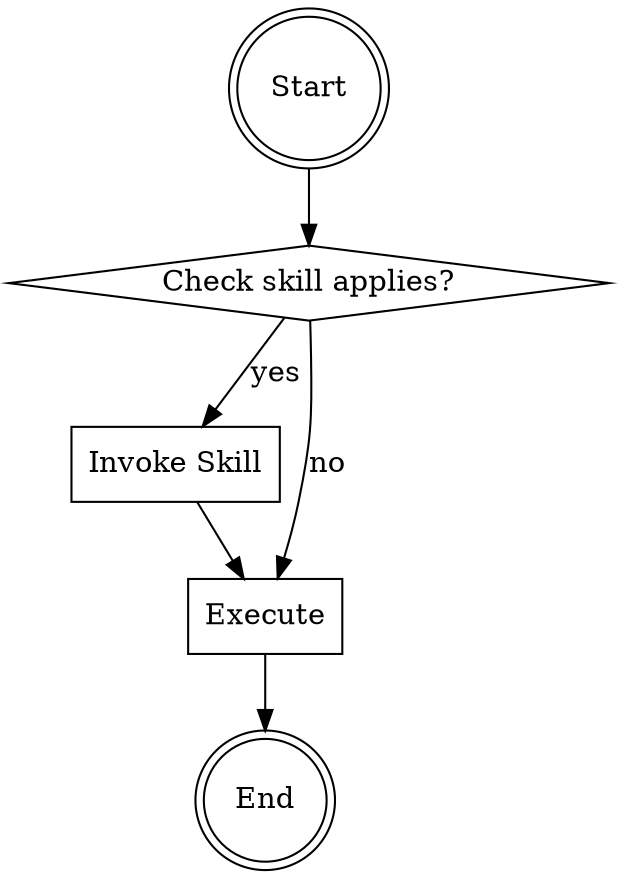

# Superpowers Code Wiki

## 项目概述

**Superpowers** 是一个面向 AI 编程 Agent 的完整软件开发方法论，构建在一组可组合的技能（Skills）和引导 Agent 正确使用这些技能的初始指令之上。

- **当前版本**: 5.1.0
- **许可证**: MIT
- **维护者**: Jesse Vincent (jesse@fsck.com)
- **社区**: [Discord](https://discord.gg/35wsABTejz) | [GitHub Issues](https://github.com/obra/superpowers/issues)
- **官方插件市场**: Claude Code、Codex CLI、Codex App、Factory Droid、Gemini CLI、OpenCode、Cursor、GitHub Copilot CLI

---

## 项目整体架构

### 目录结构

```
/workspace
├── .claude-plugin/          # Claude Code 插件配置
│   └── plugin.json
├── .cursor-plugin/          # Cursor 插件配置
│   └── plugin.json
├── .opencode/               # OpenCode 插件配置
│   └── plugins/
│       └── superpowers.js   # OpenCode 插件主文件
├── .codex-plugin/           # Codex 插件配置
│   └── plugin.json
├── skills/                  # 核心技能库
│   ├── brainstorming/       # 头脑风暴与设计
│   ├── test-driven-development/  # 测试驱动开发
│   ├── systematic-debugging/     # 系统化调试
│   ├── writing-plans/           # 编写实施计划
│   ├── subagent-driven-development/  # 子Agent驱动开发
│   ├── executing-plans/         # 执行计划
│   ├── using-git-worktrees/     # Git Worktree 使用
│   ├── finishing-a-development-branch/  # 完成开发分支
│   ├── requesting-code-review/   # 请求代码审查
│   ├── receiving-code-review/    # 接收代码审查
│   ├── dispatching-parallel-agents/  # 并行Agent调度
│   ├── verification-before-completion/  # 完成前验证
│   ├── using-superpowers/       # 使用Superpowers
│   └── writing-skills/          # 编写技能
├── hooks/                   # 启动钩子配置
│   ├── hooks.json           # Claude Code 钩子配置
│   ├── hooks-cursor.json    # Cursor 钩子配置
│   └── session-start        # Session 启动脚本
├── tests/                   # 测试套件
│   ├── brainstorm-server/    # 头脑风暴服务器测试
│   ├── claude-code/         # Claude Code 集成测试
│   ├── opencode/            # OpenCode 集成测试
│   ├── explicit-skill-requests/   # 显式技能请求测试
│   ├── skill-triggering/     # 技能触发测试
│   └── subagent-driven-dev/  # SDD 端到端测试
├── docs/                    # 设计文档和规划
│   ├── superpowers/
│   │   ├── specs/           # 设计规格文档
│   │   └── plans/           # 实施计划
│   └── plans/               # 通用规划文档
├── scripts/                 # 实用脚本
│   ├── bump-version.sh      # 版本更新脚本
│   └── sync-to-codex-plugin.sh  # Codex 同步脚本
├── assets/                  # 静态资源
├── package.json             # OpenCode npm 包配置
├── README.md                # 主文档
├── CLAUDE.md                # 贡献者指南（面向 AI Agent）
├── RELEASE-NOTES.md         # 版本发布说明
└── LICENSE                  # MIT 许可证
```

### 核心模块职责

| 模块 | 职责 | 关键文件 |
|------|------|----------|
| **Skills Library** | 提供可复用的技术、模式和最佳实践 | `skills/*/SKILL.md` |
| **Plugin System** | 跨平台插件集成（8个平台） | `.claude-plugin/`, `.opencode/plugins/` 等 |
| **Hooks System** | Session 启动时注入引导上下文 | `hooks/session-start`, `hooks.json` |
| **Brainstorm Server** | 可视化头脑风暴的 WebSocket 服务器 | `skills/brainstorming/scripts/` |
| **Test Infrastructure** | 技能行为验证和集成测试 | `tests/*/` |

---

## 核心技能详解

### 技能分类

#### 1. 流程技能（Process Skills）

这些技能决定了**如何**处理任务，必须在任何实现之前使用。

| 技能名称 | 描述 | 触发条件 |
|----------|------|----------|
| **brainstorming** | 通过苏格拉底式对话将想法转化为完整设计 | 在进行任何创造性工作之前（创建功能、构建组件、添加功能或修改行为） |
| **systematic-debugging** | 四阶段根因分析过程 | 遇到任何 bug、测试失败或意外行为时 |
| **writing-plans** | 将规格转化为详细的实施计划 | 有规格或需求需要多步实现时 |

#### 2. 执行技能（Execution Skills）

在实施阶段使用，确保高质量的代码交付。

| 技能名称 | 描述 | 触发条件 |
|----------|------|----------|
| **subagent-driven-development** | 子 Agent 驱动开发，每个任务使用独立 Agent + 两阶段审查 | 有实施计划且任务相对独立，在当前 session 中执行 |
| **executing-plans** | 批处理执行计划，在检查点暂停 | 在单独 session 中执行实施计划 |
| **test-driven-development** | 红色-绿色-重构循环 | 实现任何功能或修复 bug 之前 |
| **verification-before-completion** | 确保修复真正有效 | 任务似乎完成时 |
| **dispatching-parallel-agents** | 并行执行独立任务 | 需要同时执行多个独立任务时 |

#### 3. 协作技能（Collaboration Skills）

支持团队协作和代码质量保证。

| 技能名称 | 描述 | 触发条件 |
|----------|------|----------|
| **requesting-code-review** | 在任务之间进行代码审查 | 任务之间需要审查时 |
| **receiving-code-review** | 响应审查反馈 | 收到代码审查反馈时 |
| **finishing-a-development-branch** | 完成开发分支的决策流程 | 任务完成时 |
| **using-git-worktrees** | 使用隔离的工作空间 | 需要隔离工作区时 |

#### 4. 元技能（Meta Skills）

用于创建和维护技能本身。

| 技能名称 | 描述 | 触发条件 |
|----------|------|----------|
| **writing-skills** | 使用 TDD 方法创建新技能 | 创建或编辑技能时 |
| **using-superpowers** | 如何查找和使用技能 | 任何对话开始时 |

---

## 核心工作流程

### 基础工作流

```
1. brainstorming          → 2. using-git-worktrees     → 3. writing-plans
   (设计探索)                 (创建隔离工作区)                (编写实施计划)
                                                                         ↓
6. finishing-a-development-branch ← 5. requesting-code-review ← 4. subagent-driven-development
   (完成开发分支)                   (代码审查)                        (子Agent驱动开发)
         ↓
   提交 PR / 合并
```

### TDD 红色-绿色-重构循环

```
┌─────────────────┐
│   RED           │  编写失败的测试
│ 编写失败的测试   │  验证测试失败（不是错误）
└────────┬────────┘
         ↓
┌─────────────────┐
│   GREEN         │  编写最小代码通过测试
│  编写最小代码    │  运行测试验证通过
└────────┬────────┘
         ↓
┌─────────────────┐
│   REFACTOR      │  清理代码
│   重构          │  保持测试绿色
└─────────────────┘
```

---

## 关键类和函数说明

### OpenCode 插件 (`/.opencode/plugins/superpowers.js`)

#### SuperpowersPlugin

**主入口函数**，返回插件配置对象。

```javascript
export const SuperpowersPlugin = async ({ client, directory }) => {
  // 返回插件配置
}
```

**功能**:
- 通过 `config` 钩子注入 skills 路径到 OpenCode 配置
- 通过 `experimental.chat.messages.transform` 钩子注入引导上下文

#### getBootstrapContent()

**引导内容生成器**，使用模块级缓存避免重复磁盘 I/O。

```javascript
const getBootstrapContent = () => {
  // 读取 using-superpowers SKILL.md
  // 提取 frontmatter
  // 拼接工具映射
  // 返回完整的引导文本
}
```

**优化**: 缓存到 `_bootstrapCache`，会话生命周期内只读取一次文件系统。

#### extractAndStripFrontmatter()

**Frontmatter 解析器**，零依赖实现。

```javascript
const extractAndStripFrontmatter = (content) => {
  // 匹配 --- ... --- 块
  // 解析 YAML frontmatter
  // 返回 { frontmatter, content }
}
```

#### normalizePath()

**路径规范化工具**，处理 `~` 扩展和绝对路径解析。

```javascript
const normalizePath = (p, homeDir) => {
  // 去除首尾空白
  // 扩展 ~ 到 homeDir
  // 返回绝对路径
}
```

---

### Session 启动钩子 (`/hooks/session-start`)

**功能**: 在每次 Session 启动时注入 Superpowers 引导上下文。

**跨平台兼容性**:
- Claude Code: 输出 `hookSpecificOutput`
- 其他平台: 输出 `additionalContext`
- Windows: 使用 `run-hook.cmd` 多语言包装器

**特性**:
- POSIX 安全的 shebang (`#!/usr/bin/env bash`)
- Bash 5.3+ heredoc 修复
- 多位置 bash 发现（Windows Git Bash）
- 会话恢复时不重复注入

---

### 头脑风暴服务器 (`/skills/brainstorming/scripts/`)

#### server.cjs

**零依赖 WebSocket 服务器**（自 v5.0.2）。

**技术栈**: 纯 Node.js 内置模块（`http`, `fs`, `crypto`）

**功能**:
- HTTP 文件服务（`frame-template.html`）
- WebSocket 实时通信
- 文件监视（原生 `fs.watch()`）
- 自动退出（30分钟空闲）
- 所有者进程跟踪（PID 监控）
- 健康检查端点

**协议**: RFC 6455 WebSocket 帧处理

#### start-server.sh / stop-server.sh

**服务器生命周期管理脚本**。

```bash
# 启动服务器
./start-server.sh

# 停止服务器（带 SIGKILL 后备）
./stop-server.sh
```

---

## 技能 SKILL.md 格式规范

### Frontmatter (YAML)

```yaml
---
name: skill-name-with-hyphens
description: Use when [触发条件 - 第三人称，描述何时使用]
---
```

**要求**:
- `name`: 仅使用字母、数字和连字符
- `description`: 最多 1024 字符
- **禁止**: 总结技能工作流程，只描述触发条件

### 内容结构

```markdown
# Skill Name

## Overview
核心原则 1-2 句话

## When to Use
触发条件列表
何时不使用

## Core Pattern
技术模式或代码示例

## Quick Reference
快速参考表格

## Implementation
实现细节或指向文件的链接

## Common Mistakes
常见错误及修复

## Red Flags
停止信号列表
```

### DOT 流程图

使用 GraphViz DOT 语言定义流程。



---

## 依赖关系

### 平台支持矩阵

| 平台 | 插件文件 | 钩子配置 | 特殊处理 |
|------|----------|----------|----------|
| Claude Code | `.claude-plugin/plugin.json` | `hooks/hooks.json` | 默认 |
| Cursor | `.cursor-plugin/plugin.json` | `hooks/hooks-cursor.json` | camelCase |
| OpenCode | `.opencode/plugins/superpowers.js` | 无（内嵌） | ESM |
| Codex | `.codex-plugin/plugin.json` | 无（CLI） | 原生技能 |
| Gemini CLI | `gemini-extension.json` | `GEMINI.md` | 扩展格式 |
| Factory Droid | 远程安装 | 远程安装 | 远程 |
| GitHub Copilot | `copilot/` | `hooks/hooks.json` | 共享 |

### 技能依赖关系图

```
brainstorming ─────────────────────┐
    │                              │
    └─ writing-plans ─────────────┤
              │                   │
              └─ using-git-worktrees ─┬─ subagent-driven-development
                      │              │           │
                      │              └─ executing-plans
                      │                          │
                      └────────── requesting-code-review
                                         │
                                         ↓
                          finishing-a-development-branch

test-driven-development ←──────────────┐
    │                                 │
    └────────────→ systematic-debugging ─→ verification-before-completion

writing-skills ──→ using-superpowers
```

---

## 项目运行方式

### 安装

#### Claude Code

```bash
# 官方市场
/plugin install superpowers@claude-plugins-official

# 或 Superpowers 市场
/plugin marketplace add obra/superpowers-marketplace
/plugin install superpowers@superpowers-marketplace
```

#### OpenCode

```json
// opencode.json
{
  "plugin": ["superpowers@git+https://github.com/obra/superpowers.git"]
}
```

#### Gemini CLI

```bash
gemini extensions install https://github.com/obra/superpowers
gemini extensions update superpowers
```

#### Cursor

```
/add-plugin superpowers
```

### 测试

#### 运行全部测试

```bash
# OpenCode 测试
bash tests/opencode/run-tests.sh

# Claude Code 集成测试
bash tests/claude-code/run-skill-tests.sh

# 技能触发测试
bash tests/skill-triggering/run-all.sh
```

#### 单个测试

```bash
# OpenCode 插件加载
bash tests/opencode/test-plugin-loading.sh

# 技能触发
bash tests/skill-triggering/run-test.sh
```

---

## 测试基础设施

### 测试目录结构

```
tests/
├── brainstorm-server/      # WebSocket 服务器测试
│   ├── server.test.js      # 集成测试
│   ├── ws-protocol.test.js # WebSocket 协议测试
│   └── windows-lifecycle.test.sh
├── claude-code/            # Claude Code 集成测试
│   ├── run-skill-tests.sh
│   ├── test-subagent-driven-development.sh
│   └── analyze-token-usage.py
├── opencode/               # OpenCode 集成测试
│   ├── run-tests.sh
│   ├── test-plugin-loading.sh
│   └── test-bootstrap-caching.mjs
├── explicit-skill-requests/ # 显式技能请求测试
│   └── prompts/             # 测试提示词
├── skill-triggering/       # 技能自动触发测试
│   └── prompts/             # 测试提示词
└── subagent-driven-dev/    # 端到端 SDD 测试
    ├── go-fractals/         # Go CLI 工具项目
    └── svelte-todo/          # Svelte CRUD 应用
```

### 技能测试方法论

#### TDD for Skills

```
RED (失败测试) → GREEN (编写技能) → REFACTOR (封闭漏洞)
```

1. **RED Phase**: 运行没有技能的压力场景，记录基线行为
2. **GREEN Phase**: 编写技能解决特定问题，验证 Agent 合规
3. **REFACTOR Phase**: 发现新漏洞，添加显式计数器

#### 测试类型

| 测试类型 | 目标技能 | 测试方法 |
|----------|----------|----------|
| 纪律执行 | TDD, debugging | 压力场景 + 组合压力 |
| 技术应用 | condition-based-waiting | 应用场景 + 变体 |
| 模式识别 | reducing-complexity | 识别场景 + 应用 |
| 参考检索 | API docs | 检索场景 + 应用 |

---

## 版本历史 (v5.x)

| 版本 | 发布日期 | 主要变化 |
|------|----------|----------|
| v5.1.0 | 2026-04-30 | 移除遗留命令、工作树重写、AI Agent 贡献指南 |
| v5.0.7 | 2026-03-31 | GitHub Copilot CLI 支持、OpenCode 修复 |
| v5.0.6 | 2026-03-24 | 内联自审查替换子Agent审查循环 |
| v5.0.5 | 2026-03-17 | 头脑风暴服务器 ESM 修复 |
| v5.0.4 | 2026-03-16 | OpenCode 一行插件安装 |
| v5.0.3 | 2026-03-15 | Cursor 支持、Windows 兼容性 |
| v5.0.2 | 2026-03-11 | 零依赖头脑风暴服务器 |
| v5.0.1 | 2026-03-10 | agentskills 合规、Gemini CLI 扩展 |
| v5.0.0 | 2026-03-09 | 视觉头脑风暴伴侣、文档审查系统 |

---

## 贡献指南要点

### AI Agent 必须遵守

1. 提交前阅读完整 PR 模板
2. 搜索已存在的 PR（开和关）
3. 验证这是真实问题
4. 确认更改属于核心
5. 向人类伙伴展示完整 diff

### 不会被接受的 PR

- 第三方依赖
- 技能内容的"合规"重写
- 项目特定或个人配置
- 批量或盲目 PR
- 投机或理论修复
- 领域特定技能
- Fork 特定更改
- 编造内容

### 新 Harness 支持要求

必须包含会话转录，证明集成端到端工作：

```
用户: "Let's make a react todo list"
```

工作集成应在干净会话中自动触发 `brainstorming` 技能。

---

## 关键设计原则

### 1. 测试优先 (TDD)

> **铁律**: 没有失败的测试就不能写生产代码

- RED: 编写失败的测试
- GREEN: 编写最小代码
- REFACTOR: 清理代码

### 2. 系统化优于随机

> **铁律**: 在尝试修复之前必须找到根因

四阶段调试过程：
1. 根因调查
2. 模式分析
3. 假设与测试
4. 实施

### 3. 证据优于声明

> **铁律**: 在宣布成功之前验证

- 运行测试验证修复
- 端到端验证
- 拒绝"看起来可以"

### 4. 纪律执行

> **铁律**: 违反规则的文字就是违反规则的精神

- 禁止合理化绕过
- 显式封闭漏洞
- 红旗警告信号

---

## 资源链接

- **GitHub**: https://github.com/obra/superpowers
- **官方文档**: https://github.com/obra/superpowers/blob/main/README.md
- **问题追踪**: https://github.com/obra/superpowers/issues
- **Discord**: https://discord.gg/35wsABTejz
- **发布公告**: https://primeradiant.com/superpowers/
